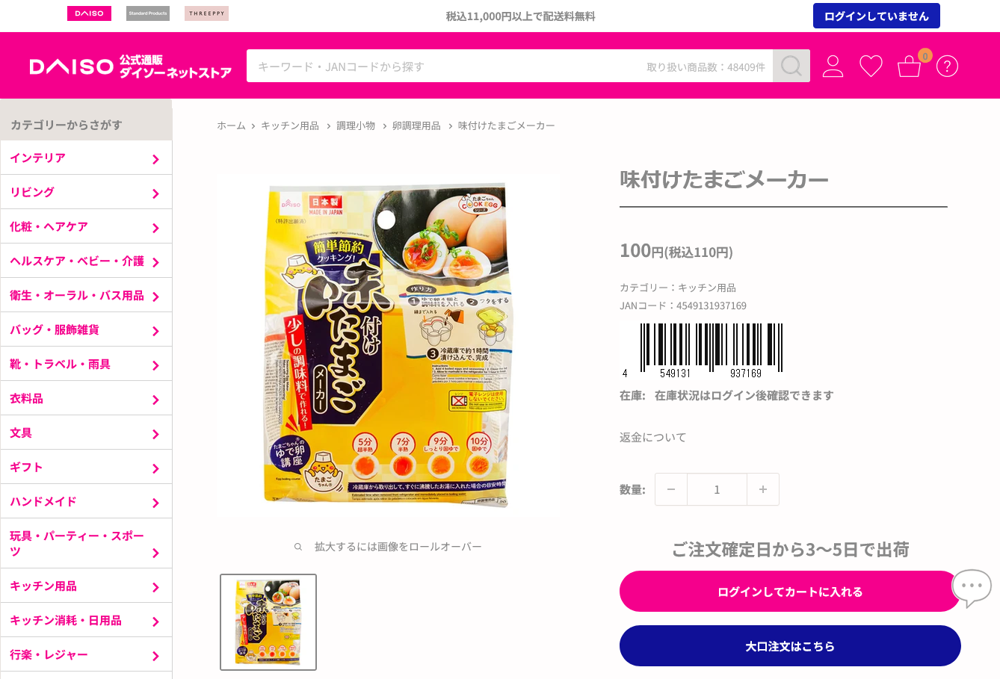

# daisojan2barcode - ダイソー JANバーコード表示

ダイソーの公式ネットショップ (単品買い [jp.daisonet.com](https://jp.daisonet.com/) / まとめ買い [jpbulk.daisonet.com](https://jpbulk.daisonet.com/)) の商品ページに表示されている **JANコードを自動でバーコード化して挿入する** Tampermonkey ユーザースクリプトです。

出典：ダイソーネットストア商品ページ https://jp.daisonet.com/products/4549131937169

## 機能

- 商品詳細ページの「JANコード：」表記の下に、**EAN-13 形式のバーコード** を自動挿入
- スマホのダイソーアプリが持つバーコード読み取り機能で読み取り可能

## 対象ページ

| URL パターン | 対応 |
|---|---|
| `https://jp.daisonet.com/products/*` (単品買い・商品詳細ページ) | ✅ バーコード表示 |
| `https://jpbulk.daisonet.com/products/*` (まとめ買い・商品詳細ページ) | ✅ バーコード表示 |
| 一覧・検索・その他のページ | ❌ 動作なし |

## 導入方法

### 方法 1: 配布サイトからインストール (推奨)

1. ブラウザに [Tampermonkey](https://www.tampermonkey.net/) 拡張機能をインストール
2. 配布サイト <https://kleinchan-dev.github.io/daisojan2barcode/> を開き、「クリックしてインストール」をクリック → Tampermonkey のインストール画面で「インストール」

インストール後は Tampermonkey が定期的に同じ URL から更新を確認して自動更新します。手動で更新する場合は、ダッシュボードの「ユーティリティ」タブ →「ユーザースクリプトを更新」を実行してください。

### 方法 2: 手動で貼り付け

1. ブラウザに [Tampermonkey](https://www.tampermonkey.net/) 拡張機能をインストール
2. Tampermonkey のダッシュボードを開き、「新規スクリプトを作成」をクリック
3. エディタの内容をすべて消去し、`daisojan2barcode.user.js` の中身を貼り付けて保存 (`Ctrl + S`)

> 既に開いている商品ページがある場合は、再読み込みしてください。

動作確認: 個別の商品ページを開いてバーコードが表示されることを確認してください。

## 仕組み

### JANコードの取得

以下の順で取得を試みます (上流が失敗した場合のみ次へフォールバック)。

1. ページ表示中の `.product-meta__sku-number` 要素のテキスト
2. ページ内 JSON-LD (`application/ld+json`) の `gtin13` プロパティ
3. URL パス `/products/{13桁}` からの抽出

> [!NOTE]
> まとめ買いサイト (jpbulk.daisonet.com) は JSON-LD に `gtin13` が存在しないため、実質的には「表示テキスト → URL パス」の順で解決されます。両サイトとも商品ページの DOM 構造 (セレクタ) は同一です。

### 描画

- 取得した13桁が EAN-13 チェックディジット検証を通過した場合のみ、[JsBarcode](https://github.com/lindell/JsBarcode) (v3.11.6、jsDelivr CDN 経由) で SVG を生成して挿入します。
- 挿入位置は JANコード表記ブロック (`.product-meta__reference`) の直下です。

### 動的変更への追従

`MutationObserver` (デバウンス 200ms) により、テーマ側 JS による DOM 再描画やバリエーション切替が発生してもバーコードを自動的に再描画します。無限ループは「同一 JAN かつ既存ノードが存在する場合は何もしない」ことで防止しています。

## ファイル構成

| ファイル | 説明 |
|---|---|
| `index.html` | GitHub Pages 配布サイト |
| `daisojan2barcode.user.js` | Tampermonkey ユーザースクリプト本体 |
| `.nojekyll` | GitHub Pages の Jekyll 処理を無効化するマーカー |

## 動作環境

- Tampermonkey が動作するブラウザ (Chrome / Edge / Firefox など)
- 外部ライブラリ: JsBarcode 3.11.6 を `@require` で CDN から読み込み

## 免責事項

本スクリプトは個人利用のためのものです。サイト構造の変更により動作しなくなる場合があります。ダイソー・大創産業とは関係ありません。

本スクリプトの使用によって生じたいかなる損害・不利益についても、作者は一切の責任を負いません。使用者自身の責任においてご利用ください。
